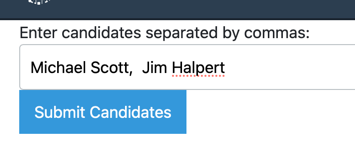
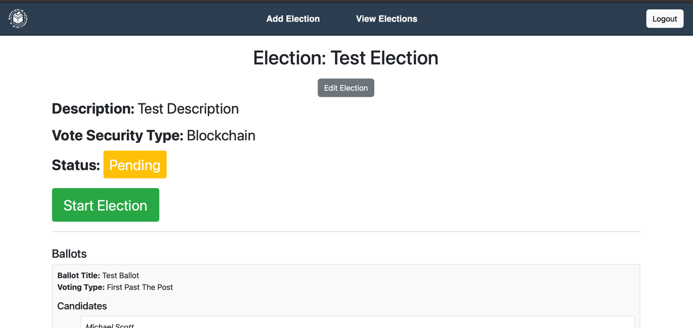

# NextGenVoting - How to Install and Use
# 1. Installation and Setup
open terminal and cd to directory

```bash
cd path/to/nextgenvoing
```

Make sure django is installed
```bash
pip install django
```

Start virtual Environment

- *Mac:*
```bash
source venv/bin/activate
```

- *Windows:*
```bash
venv\Scripts\activate
```


# 2. PostgreSQL Setup

Follow this tutral to get postgres installed
https://www.w3schools.com/postgresql/postgresql_install.php

create database
- *Mac:*
```bash
postgres psql
```

- *Windows:*
```bash
psql -U postgres
```

Once in the postgres shell run:
```sql
CREATE DATABASE local_nextgenvoting;
```


# 3. Configuration
 
Once the database it set up, open the file called .env in this project. you then need to update the 
postgres credentials to fit your new credentials

```bash
# postgres credentials
DB_ENGINE=django.db.backends.postgresql
DB_NAME=local_nextgenvoting
DB_USER=*Your username*
DB_PASSWORD=*Your password*
DB_HOST=localhost
DB_PORT=5432
```

# 4. Backend Setup
## Now just some more things before we can start the project. Go back to your terminal.

### Install Dependencies
Install all required Python packages from `requirements.txt`:

```bash
pip install -r requirements.txt
```

### make and run migrations (sets up tabes in database)
```bash
python manage.py makemigrations
```
```bash
python manage.py migrate
```

### create superuser
```bash
python manage.py createsuperuser
```

# 5. Running the Server
run this command to start the server
```bash
python manage.py runserver
```

The server should be running in the terminal. 


# 6. Starting Background Services
There are also some background services that need to run alongside the server. So either open two new terminal windows, 
or open new tabs by clicking right on the terminal. cd to the project, and run the following commands on each new terminal

```bash
redis-server   
```

```bash
celery -A nextgenvoting worker
```


# 7. Usage
Once the server is started, you can goto the following link on your browser to view the website:

## Sign in / Register
Click Register at the top right of the screen


### enter a username and password


### Or if you have an account click signin


## Create election
### From the dashboard, click add election


### Fill in the detils of the election
#### The number of ballots is the amount of different topics you want the voters to vote on
#### The Use blockchain button will determine if the votes are stored in the database or in the blockchain


### It will then ask you to fill in the details of each ballot
#### its title and the voting type


### Now enter the candidate names seperated by a coma.


### new we need to upload a CSV with the names and emails of the voters
#### the csv should look like this


### you will then see the summary page - scroll to the bottom to confirm 


### You will then see the election appear on the dashboard


## Start/Edit election
### if you click on manage election, you will come to the manage election page



#### you can edit the election by clicking edit election 


you can edit each balllot aswell


#### or add new ones


### Once you click start, All the voters will recieve an email with a unique link to their voting ballots. 
### Once votes start coming in, you can ed the election and the votes will be counted


